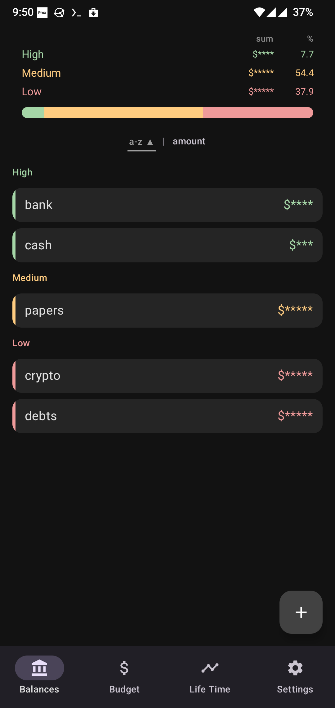
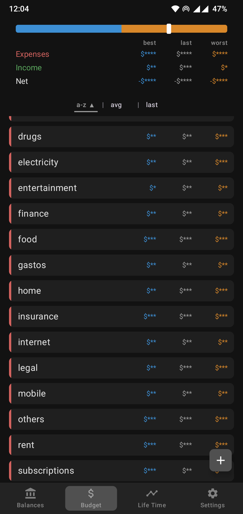
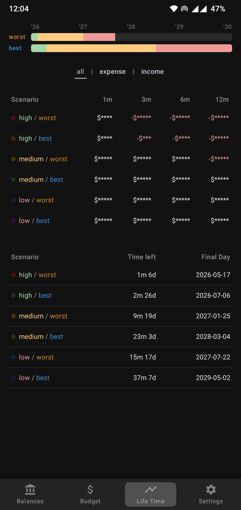

# Time of My Life

Opinionated budget planner for Android.
Answers one question:
**how long can you live on your current savings?**

Enter your balances and monthly budget, and the app computes
how many months your money lasts across six scenarios — from
your most reliable assets in the worst case to everything you
own with an optimistic budget.

All data is stored locally. No network access, no accounts. Make backups!

<table>
  <tr>
    <td></td>
    <td></td>
    <td></td>
  </tr>
</table>

## How it works

**Balances** screen is your assets, grouped by reliability:

- **High** - cash, bank accounts. Available at any time.
- **Medium** - brokerage, stablecoins. Can be liquidated in a few days/weeks.
- **Low** - crypto, debts. Money you can't rely on at all.

**Budget** screen is your expences ans incomes in three scenarios:

- **Best** - optimistic scenario
- **Last** - actual amount spent/gain during last month
- **Worst** - pessimistic scenario

**Life Time** screen is two tables:

- **Monthly** — projected balance at 1/3/6/12 months across six scenarios.
- **Survival** — for each scenario: time left and the projected day when u r broke.

That's all! Works for me, might work for you too.

## Build

```bash
# Debug APK
make build
# Install on connected device
make install
# Lint (ktlint + detekt + markdownlint)
make lint
# Format Kotlin sources
make format
# Unit tests
make test
# Run all checks
make all
```

Requires Android SDK (`ANDROID_HOME`) and JDK 21 (`JAVA_HOME`).
See `Makefile` for defaults.

Minimum SDK: 26 (Android 8.0). Target SDK: 35.
